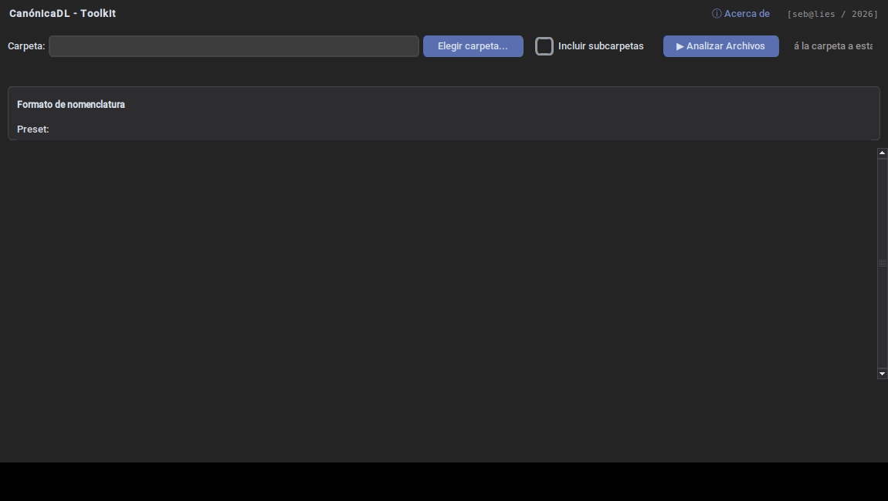

# CanónicaDL

**Toolkit de escritorio para organizar bibliotecas digitales.** Analiza
carpetas de PDF, EPUB y DOCX, busca la información bibliográfica en
internet (Google Books, Open Library, Crossref) y renombra todo
automáticamente siguiendo un formato configurable — personalizado o
APA 7 — dejando la colección ordenada y consistente.



## Por qué

Si tenés cientos de PDFs de papers, libros y tesis con nombres de archivo
como `descarga (3).pdf` o `39_ARCHENTI-PIOVANI_cap2.pdf`, CanónicaDL busca
el autor, título y año reales de cada uno y los renombra en lote, de forma
prolija y consistente, sin tener que hacerlo a mano uno por uno.

## Características

- **Multi-formato**: PDF, EPUB y DOCX (mantiene la extensión original)
- **Múltiples fuentes de búsqueda**: Google Books, Open Library (por ISBN),
  Crossref (artículos académicos/DOI), con validación para evitar falsos
  positivos en títulos cortos o genéricos
- **Reconoce patrones ya presentes en el nombre del archivo**
  (`Título - Autor`, `Autor, Título`, `Título_Autor`, prefijos numéricos)
- **Múltiples autores** con formato APA 7 automático
- **Plantillas de nomenclatura configurables**, con presets (APA 7 libro/
  artículo, personalizado) y la posibilidad de guardar los tuyos propios
- **Tabla editable estilo planilla**: edición en la celda, navegación con
  teclado (flechas + Enter), orden por columna, colores por estado
- **Búsqueda manual** cuando la automática no encuentra nada, con opción de
  cargar los datos a mano
- **Arrastrar y soltar** carpetas
- **Tema oscuro** en toda la interfaz

Para el detalle técnico completo (arquitectura, librerías, lógica de
decisión de nombres), ver [`RESUMEN_TECNICO.md`](RESUMEN_TECNICO.md).

## Instalación

### Windows — usar el ejecutable ya compilado (más simple)

Descargá el `.exe` más reciente desde
[Releases](../../releases) y ejecutalo directo. No necesita Python
instalado.

### Windows — compilar desde el código fuente

1. Instalá [Python 3.9+](https://www.python.org/downloads/) (tildando
   **"Add python.exe to PATH"** durante la instalación).
2. Cloná o descargá este repositorio.
3. Ejecutá `generar_exe.bat` (doble clic). Instala las dependencias y
   genera el ejecutable automáticamente.
4. El resultado queda en `dist\CanonicaDL.exe`.

### Correr directo con Python, sin compilar

```bash
pip install -r requirements.txt
python app.py
```

(En Windows también podés usar `ejecutar_sin_compilar.bat`.)

## Uso

1. Elegí una carpeta (botón, o arrastrándola a la ventana) — la app te
   muestra cuántos archivos compatibles encontró antes de analizar.
2. Elegí el formato de nomenclatura (preset o plantilla propia).
3. Tocá **"▶ Analizar Archivos"**.
4. Revisá los resultados: verde = confirmado, amarillo = sin confirmar,
   rojo = sin datos. Editá lo que haga falta directo en la tabla.
5. Seleccioná las filas que querés renombrar (o dejá todo sin seleccionar
   para renombrar todo) y tocá **"Renombrar seleccionados/todos"**.

## Stack técnico

Python 3 · [CustomTkinter](https://github.com/TomSchimansky/CustomTkinter)
· `ttk.Treeview` · `tkinterdnd2` · `requests` · `pypdf` · PyInstaller

Sin dependencias de IA/ML — toda la lógica es determinística (reglas de
texto, expresiones regulares, APIs bibliográficas públicas).

## Historial de versiones

Ver [`CHANGELOG.md`](CHANGELOG.md).

## Licencia

[MIT](LICENSE) — Sebastián Alies ([sebastianalies.com](https://sebastianalies.com))
